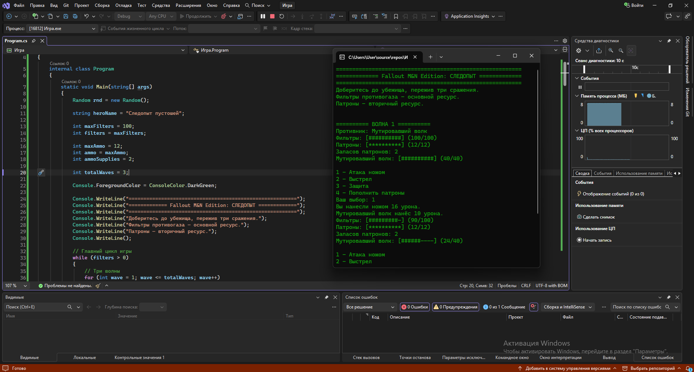
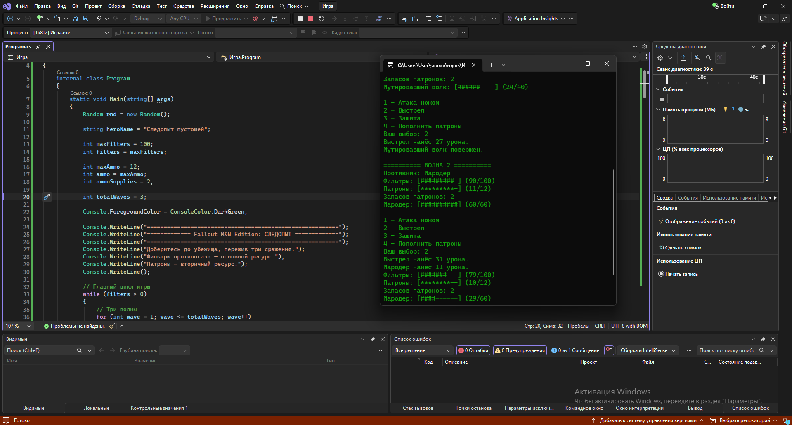
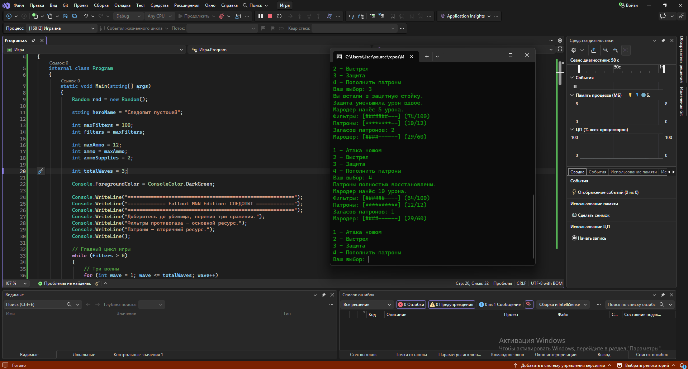
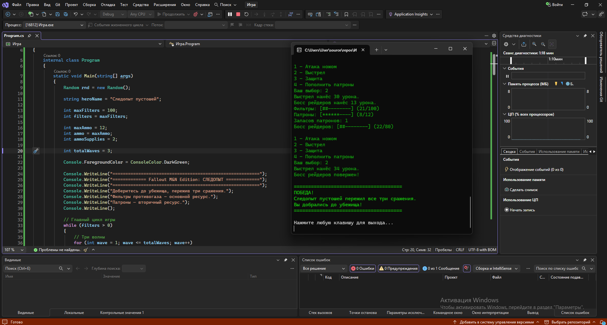

# Практическая работа №4
## Выполнили студенты группы П25-2.1. Оганджанян Нарек Артёмикович и Хохлов Максим
## Тема: Постапокалипсис

<picture>  
</picture>

<picture>  
</picture>

<picture>  
</picture>

<picture>  
</picture>

<picture>  
</picture>

---
``` csharp
```
using System;

namespace Игра
{
    internal class Program
    {
        static void Main(string[] args)
        {
            Random rnd = new Random();

            string heroName = "Следопыт пустошей";

            int maxFilters = 100;
            int filters = maxFilters;

            int maxAmmo = 12;
            int ammo = maxAmmo;
            int ammoSupplies = 2;

            int totalWaves = 3;

            Console.ForegroundColor = ConsoleColor.DarkGreen;

            Console.WriteLine("=========================================================");
            Console.WriteLine("============= Fallout M&N Edition: СЛЕДОПЫТ =============");
            Console.WriteLine("=========================================================");
            Console.WriteLine("Доберитесь до убежища, пережив три сражения.");
            Console.WriteLine("Фильтры противогаза — основной ресурс.");
            Console.WriteLine("Патроны — вторичный ресурс.");
            Console.WriteLine();

            // Главный цикл игры
            while (filters > 0)
            {
                // Три волны
                for (int wave = 1; wave <= totalWaves; wave++)
                {
                    string enemyName;
                    int enemyHp;
                    int maxEnemyHp;
                    int minEnemyDamage;
                    int maxEnemyDamage;

                    // Настройка врага
                    switch (wave)
                    {
                        case 1:
                            enemyName = "Мутировавший волк";
                            maxEnemyHp = 40;
                            minEnemyDamage = 8;
                            maxEnemyDamage = 13;
                            break;

                        case 2:
                            enemyName = "Мародер";
                            maxEnemyHp = 60;
                            minEnemyDamage = 10;
                            maxEnemyDamage = 16;
                            break;

                        default:
                            enemyName = "Босс рейдеров";
                            maxEnemyHp = 80;
                            minEnemyDamage = 12;
                            maxEnemyDamage = 20;
                            break;
                    }

                    enemyHp = maxEnemyHp;

                    Console.WriteLine();
                    Console.WriteLine($"========== ВОЛНА {wave} ==========");
                    Console.WriteLine($"Противник: {enemyName}");

                    // Бой
                    while (enemyHp > 0 && filters > 0)
                    {
                        // ============================== Полоса ХП ====================================
                        int scaleLengthFilters = 10;
                        int filledCellsFilters = filters * scaleLengthFilters / maxFilters;

                        int emptyCellsFilters = scaleLengthFilters - filledCellsFilters;

                        Console.Write("Фильтры: [");

                        for (int i = 0; i < filledCellsFilters; i++)
                            Console.Write("#");

                        for (int i = 0; i < emptyCellsFilters; i++)
                            Console.Write("-");

                        Console.WriteLine($"] ({filters}/{maxFilters})");

                        //=================================== Патроны ==========================================

                        int scaleLengthAmmo = 10;
                        int filledCellsAmmo = ammo * scaleLengthAmmo / maxAmmo;

                        int emptyCellsAmmo = scaleLengthAmmo - filledCellsAmmo;

                        Console.Write("Патроны: [");

                        for (int i = 0; i < filledCellsAmmo; i++)
                            Console.Write("*");

                        for (int i = 0; i < emptyCellsAmmo; i++)
                            Console.Write("-");

                        Console.WriteLine($"] ({ammo}/{maxAmmo})");

                        Console.WriteLine($"Запасов патронов: {ammoSupplies}");

                        //=================================== Полоса ХП Врага ==========================================

                        int scaleLengthEnemy = 10;
                        int filledCellsEnemy = enemyHp * scaleLengthEnemy / maxEnemyHp;

                        int emptyCellsEnemy = scaleLengthEnemy - filledCellsEnemy;

                        Console.Write($"{enemyName}: [");

                        for (int i = 0; i < filledCellsEnemy; i++)
                            Console.Write("#");

                        for (int i = 0; i < emptyCellsEnemy; i++)
                            Console.Write("-");

                        Console.WriteLine($"] ({enemyHp}/{maxEnemyHp})");

                        //====================================== Меню ====================================================
                        int action;
                        bool actionCompleted;

                        do
                        {
                            Console.WriteLine();
                            Console.WriteLine("1 — Атака ножом");
                            Console.WriteLine("2 — Выстрел");
                            Console.WriteLine("3 — Защита");
                            Console.WriteLine("4 — Пополнить патроны");
                            Console.Write("Ваш выбор: ");

                            actionCompleted = int.TryParse(
                                Console.ReadLine(),
                                out action
                            ) && action >= 1 && action <= 4;

                            if (!actionCompleted)
                                Console.WriteLine("Введите число от 1 до 4!");

                        } while (!actionCompleted);

                        bool defending = false;

                        // Действие игрока
                        switch (action)
                        {
                            case 1:
                                int knifeDamage = rnd.Next(12, 21);
                                enemyHp -= knifeDamage;

                                Console.WriteLine($"Вы нанесли ножом {knifeDamage} урона.");
                                break;

                            case 2:
                                if (ammo > 0)
                                {
                                    int pistolDamage = rnd.Next(25, 36);
                                    ammo--;
                                    enemyHp -= pistolDamage;

                                    Console.WriteLine($"Выстрел нанёс {pistolDamage} урона.");
                                }
                                else
                                {
                                    Console.WriteLine("Патронов нет! Ход не расходуется.");

                                    continue;
                                }

                                break;

                            case 3:
                                defending = true;

                                Console.WriteLine("Вы встали в защитную стойку.");
                                break;

                            case 4:
                                if (ammoSupplies > 0)
                                {
                                    ammo = maxAmmo;
                                    ammoSupplies--;

                                    Console.WriteLine("Патроны полностью восстановлены.");
                                }
                                else
                                {
                                    Console.WriteLine("Запасов больше нет! Ход не расходуется.");

                                    continue;
                                }

                                break;
                        }

                        // Проверяем, погиб ли враг
                        if (enemyHp <= 0)
                        {
                            Console.WriteLine($"{enemyName} повержен!");
                            break;
                        }

                        // Атака врага
                        int enemyDamage = rnd.Next(minEnemyDamage,maxEnemyDamage);

                        if (defending)
                        {
                            enemyDamage /= 2;
                            Console.WriteLine("Защита уменьшила урон вдвое.");
                        }

                        filters -= enemyDamage;

                        if (filters < 0)
                            filters = 0;

                        Console.WriteLine($"{enemyName} нанёс {enemyDamage} урона.");

                        // Проверяем смерть героя
                        if (filters <= 0)
                        {
                            Console.ForegroundColor = ConsoleColor.Red;
                            Console.WriteLine();
                            Console.WriteLine($"{heroName} погиб! Фильтры закончились.");
                            Console.ResetColor();
                        }
                    }
                }

                // Если все три волны пройдены
                if (filters > 0)
                {
                    Console.ForegroundColor = ConsoleColor.Green;
                    Console.WriteLine();
                    Console.WriteLine("======================================");
                    Console.WriteLine("ПОБЕДА!");
                    Console.WriteLine($"{heroName} пережил все три сражения.");
                    Console.WriteLine("Вы добрались до убежища!");
                    Console.WriteLine("======================================");
                    Console.ResetColor();

                    break;
                }
            }

            Console.WriteLine();
            Console.WriteLine("Нажмите любую клавишу для выхода...");
            Console.ReadKey();
        }
    }
}
